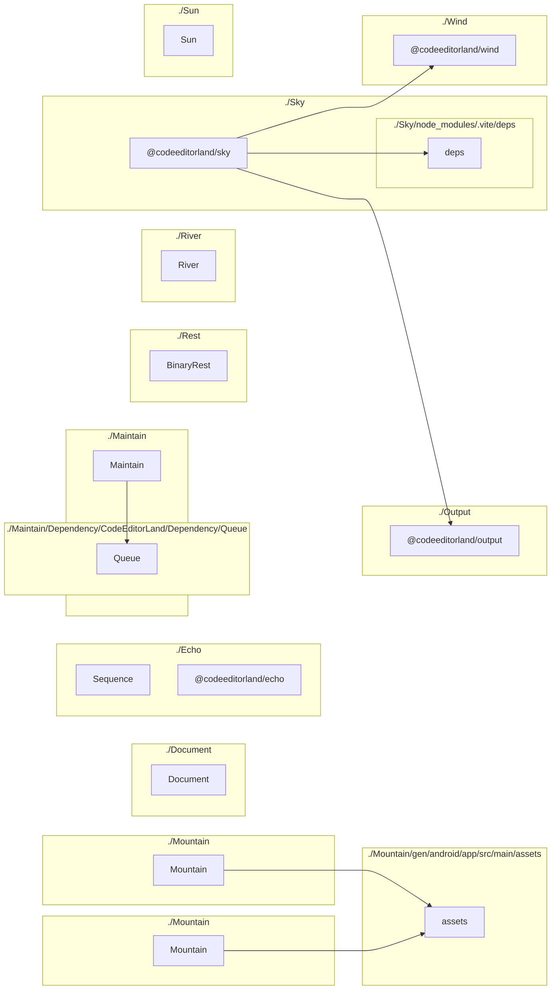

```mermaid
graph LR
  subgraph Document ["./Document"]
    node0[Document]
  end
  subgraph Echo ["./Echo"]
    node1[Sequence]
    node2["@codeeditorland/echo"]
  end
  subgraph Maintain ["./Maintain"]
    node3[Maintain]
    subgraph Queue ["./Maintain/Dependency/CodeEditorLand/Dependency/Queue"]
      node4[Queue]
    end
  end
  subgraph Mountain1 ["./Mountain"]
    node5[Mountain]
  end
  subgraph assets ["./Mountain/gen/android/app/src/main/assets"]
    node6[assets]
  end
  subgraph Mountain2 ["./Mountain"]
    node7[Mountain]
  end
  subgraph Output ["./Output"]
    node8["@codeeditorland/output"]
  end
  subgraph Rest ["./Rest"]
    node9[BinaryRest]
  end
  subgraph River ["./River"]
    node10[River]
  end
  subgraph Sky ["./Sky"]
    node12["@codeeditorland/sky"]
    subgraph deps ["./Sky/node_modules/.vite/deps"]
      node11[deps]
    end
  end
  subgraph Sun ["./Sun"]
    node13[Sun]
  end
  subgraph Wind ["./Wind"]
    node14["@codeeditorland/wind"]
  end
  node3 --> node4
  node5 --> node6
  node7 --> node6
  node12 --> node11
  node12 --> node8
  node12 --> node14
```
